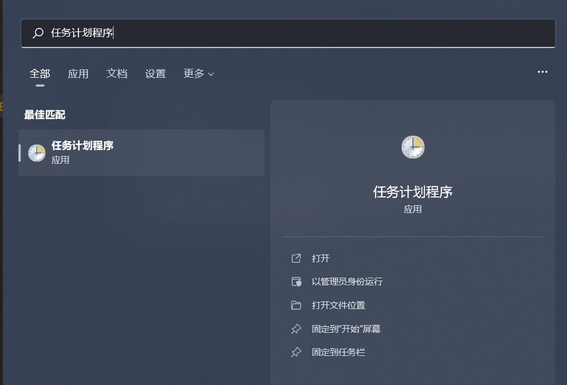
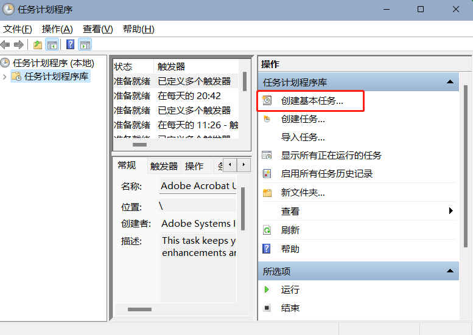
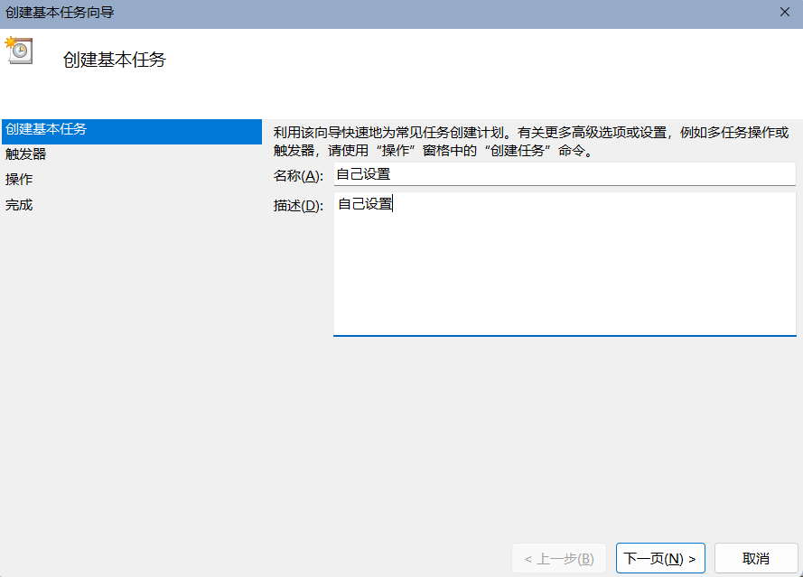
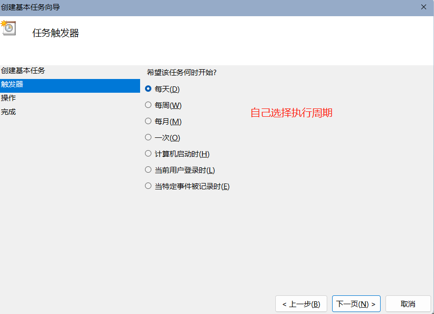
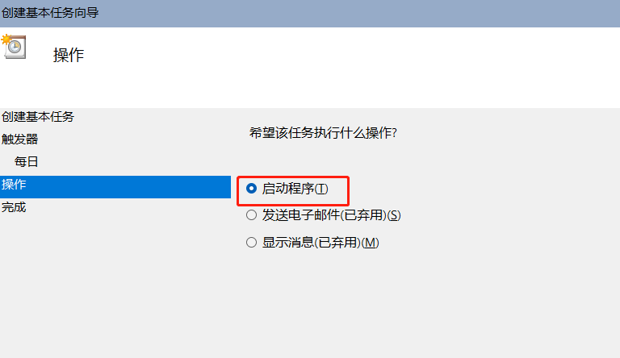
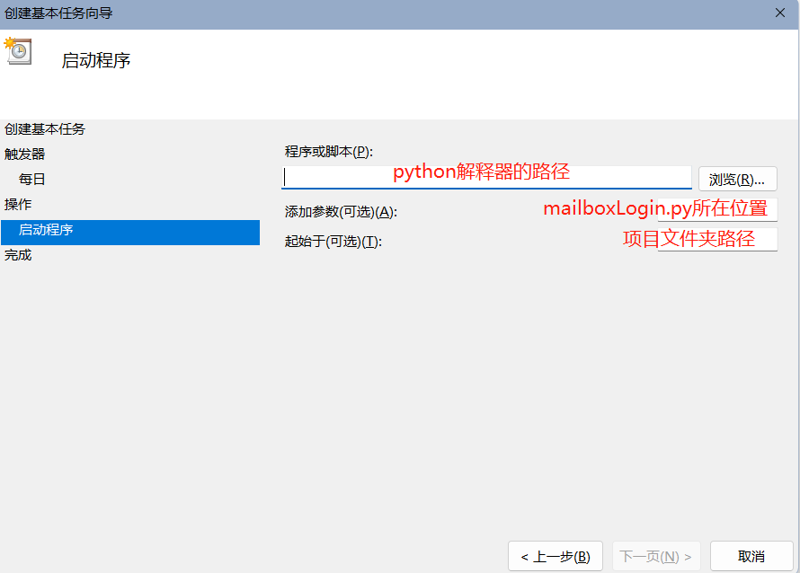
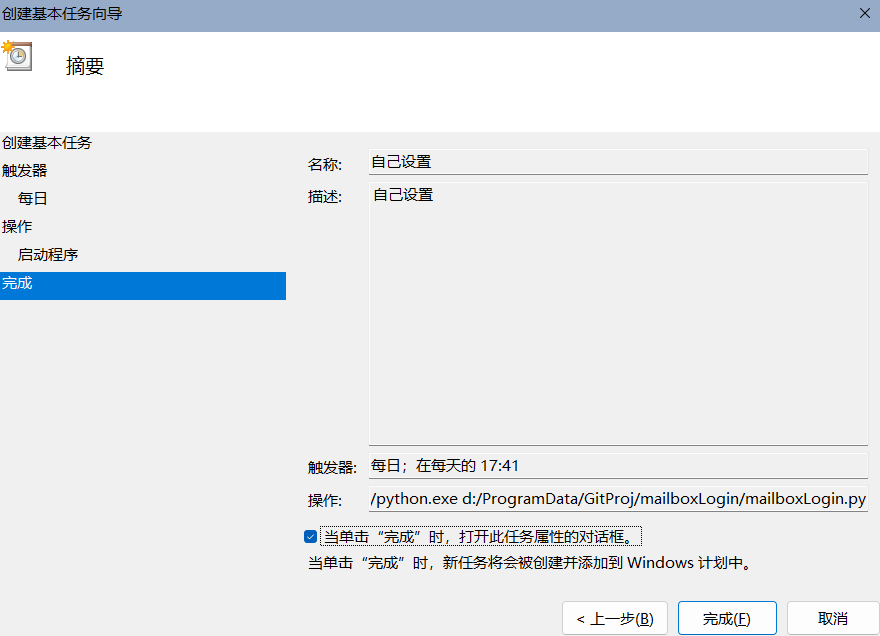
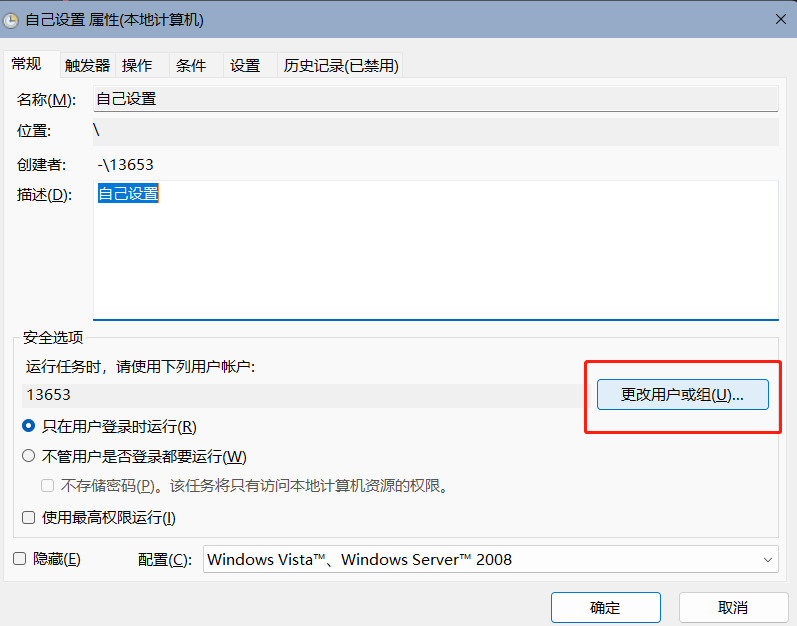

# PKUMailboxLogin

非常非常非常简单的pku邮箱登陆器，防止毕业生半年不登陆邮箱使得邮箱失效

## 所需环境

- python 3
- selenium
  - 安装方法: `pip install selenium==3.141.0`

## 使用方法
  
- `git clone`到本地/服务器
- 设置定时任务
  - linux/macOS: crontab定时任务，将启动python脚本的shell命令如`python {replace_to_the_right_directory}/mailboxLogin.py`写入一个.sh文件，然后crontab -e设置自己想要的执行周期。配置方法可以自行谷歌，可参考[菜鸟教程](https://www.runoob.com/w3cnote/linux-crontab-tasks.html)
  - windows: 使用任务计划程序
    - 进入
    - 点击右边的“创建基本任务”
    - 设置自己的任务名
    - 设置执行周期和时间
    - 选择“执行程序”
    - 填入文件路径
    - 最后如图,注意要选中小方框
    - 在弹出的小方框中选择“更改用户或组”
    - 然后选择高级-立即查找-SYSTEM-点击两次确定。这是必须的，如果执行用户不是SYSTEM，在执行的时候将会弹出cmd命令框，非常让人讨厌。接着就大功告成！
